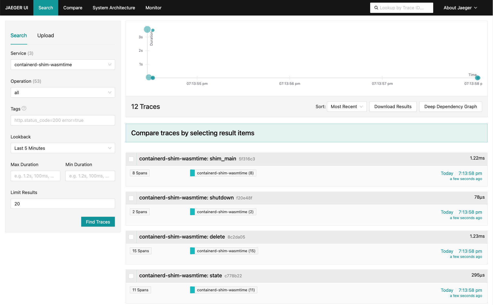
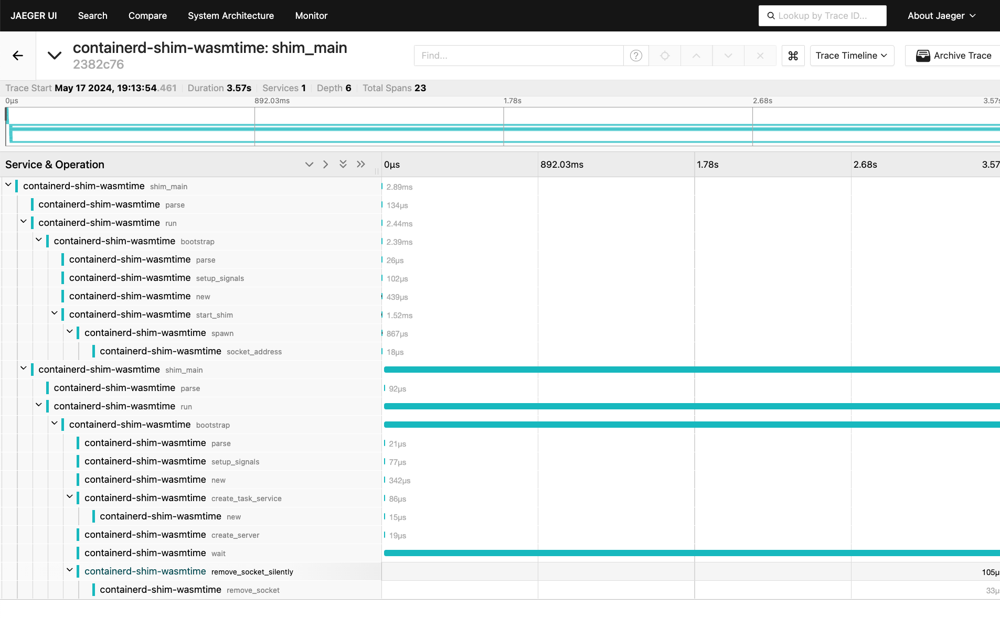

# OpenTelemetry

[OpenTelemetry](https://opentelemetry.io/) is a set of libraries, agents, and instrumentation to provide observability (metrics, logs and traces) in applications.

`containerd-shim-wasm` crate has a set of APIs to enable OpenTelemetry tracing in the shim. This document is a guide on how to use OpenTelemetry tracing in your shim.

## Usage

To use OpenTelemetry tracing in your shim, you need to use the `opentelemetry` feature in the `containerd-shim-wasm` crate and the `tokio` crate.
```toml
containerd-shim-wasm = { workspace = true, features = ["opentelemetry"] }
tokio = { version = "1", features = ["full"] }
```

Then, you may use the `containerd_shim_wasm::sandbox::cli::shim_main_with_otel` function to run the shim with OpenTelemetry tracing.

```rust
#[tokio::main]
async fn main() {
    shim_main_with_otel::<WasmtimeInstance>("wasmtime", version!(), revision!(), "v1", None);
}
```

You may also use the `containerd_shim_wasm::sandbox::shim::OtelConfig` struct to configure the OpenTelemetry tracing manually.

### Running containerd with OpenTelemetry

You can run containerd with OpenTelemetry tracing by setting the following environment variables.

```sh
OTEL_EXPORTER_OTLP_ENDPOINT=http://localhost:4318

# by default, Containerd uses the `http/protobuf` protocol
```

`Runwasi` will automatically pick up the environment variables and start exporting traces to the specified endpoint.
 
### Jeager Exporter

You may use Jeager exporter to see the traces in the Jeager UI.

```sh
docker run -d -p16686:16686 -p4317:4317 -p4318:4318 -e COLLECTOR_OTLP_ENABLED=true jaegertracing/all-in-one:latest
```

You can access the Jeager UI at `http://localhost:16686`.

### Demo

Assuming you have built or installed the `containerd-shim-wasmtime-v1` shim binary and the demo wasm image following README.md instructions,
you can run a the wasmtime shim with OpenTelemetry tracing by running the following command

```sh
sudo ctr run  --net-host --rm --runtime=io.containerd.wasmtime.v1 ghcr.io/containerd/runwasi/wasi-demo-app:latest testwasm /wasi-demo-app.wasm sleep 3
```





## Environment Variables

`Runwasi` uses the standard [OTLP environment variables](https://opentelemetry.io/docs/languages/sdk-configuration/otlp-exporter/) to configure the OTLP exporter endpoint. The following environment variables are supported:

`OTEL_EXPORTER_OTLP_ENDPOINT` - The endpoint to send trace data to.
`OTEL_EXPORTER_OTLP_PROTOCOL` - The protocol to use when sending trace data. Default is `http/protobuf`. Valid values are `http/protobuf`, `grpc`.

## Context Propagation

`Runwasi` uses the `TRACECONTEXT` environment variable to propagate the trace context between the parent shim process and the child. The trace context is a W3C Trace Context header.